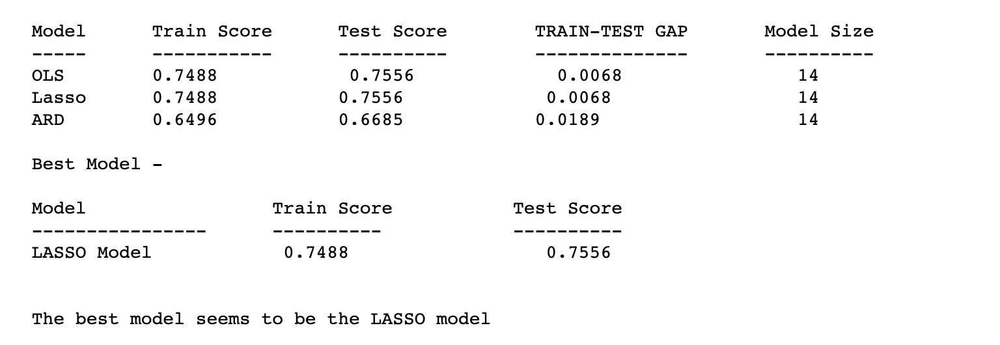

# Regression-Model-Development
Regression Model Analysis through the use of various models
In this assignment, we were tasked with using the information in our chef course case to build a predictive model on a continuous response variable (Y-variable). This assignment encompassed feature engineering, model preparation, variable selection, and model development.
The resgression models used were OLS Regression, Lasso Regression and ARD regression.

